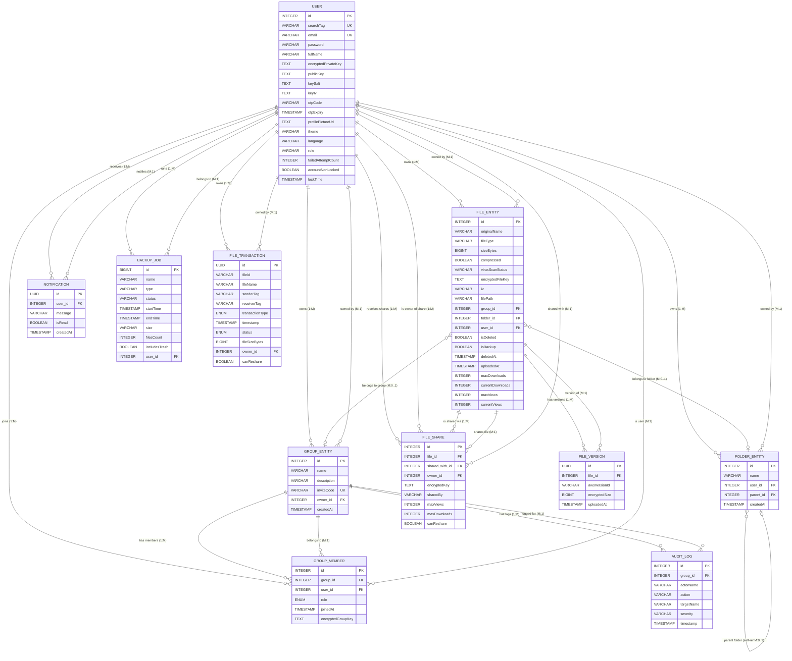

# SafeShare — Database ERD & Relationships

Use this document as a reference to design your ERD in your preferred tool (draw.io, Lucidchart, dbdiagram.io, etc.).

---

## ER Diagram (Mermaid)

---

## Entities & Attributes Reference

### 1. `_user` (User)

| Column | Type | Constraints | Description |
|--------|------|-------------|-------------|
| `id` | INTEGER | PK, AUTO_INCREMENT | Unique user identifier |
| `search_tag` | VARCHAR | UNIQUE, NOT NULL | Unique tag for user discovery (immutable) |
| `email` | VARCHAR | UNIQUE, NOT NULL | Login email address |
| `password` | VARCHAR | NOT NULL | BCrypt-hashed password |
| `full_name` | VARCHAR | — | Display name |
| `encrypted_private_key` | TEXT | — | RSA private key encrypted with PBKDF2-derived key |
| `public_key` | TEXT | — | RSA public key (used by others to encrypt shared keys) |
| `key_salt` | TEXT | — | PBKDF2 salt for private key derivation |
| `key_iv` | TEXT | — | IV used to encrypt the private key |
| `otp_code` | VARCHAR | — | Current OTP code (null when not pending) |
| `otp_expiry` | TIMESTAMP | — | When the current OTP expires |
| `profile_picture_url` | TEXT | — | Profile picture URL |
| `theme` | VARCHAR(20) | DEFAULT `'system'` | UI theme preference |
| `language` | VARCHAR(10) | DEFAULT `'en'` | Language preference |
| `role` | VARCHAR(50) | DEFAULT `'USER'` | Application role |
| `failed_attempt_count` | INTEGER | NOT NULL, DEFAULT `0` | Login failure counter |
| `account_non_locked` | BOOLEAN | NOT NULL, DEFAULT `true` | Account lock status |
| `lock_time` | TIMESTAMP | — | When account was locked |

---

### 2. `secure_files` (FileEntity)

| Column | Type | Constraints | Description |
|--------|------|-------------|-------------|
| `id` | INTEGER | PK, AUTO_INCREMENT | Unique file identifier |
| `original_name` | VARCHAR | NOT NULL | Original filename |
| `file_type` | VARCHAR | NOT NULL | File category (document, image, video) |
| `size_bytes` | BIGINT | — | File size in bytes |
| `compressed` | BOOLEAN | — | Whether file is compressed |
| `virus_scan_status` | VARCHAR | — | Scan result: `clean` / `infected` |
| `encrypted_file_key` | TEXT | NOT NULL | AES-256 key encrypted with owner's RSA public key |
| `iv` | VARCHAR | NOT NULL | AES-GCM initialisation vector |
| `file_path` | VARCHAR | NOT NULL | Storage path (S3 key or local path) |
| `group_id` | INTEGER | FK → `groups.id`, NULLABLE | Group this file belongs to (null = private) |
| `folder_id` | INTEGER | FK → `secure_folders.id`, NULLABLE | Parent folder |
| `user_id` | INTEGER | FK → `_user.id`, NOT NULL | File owner |
| `is_deleted` | BOOLEAN | NOT NULL, DEFAULT `false` | Soft-delete flag |
| `is_backup` | BOOLEAN | DEFAULT `false` | Deduplication backup flag |
| `deleted_at` | TIMESTAMP | — | When file was soft-deleted |
| `uploaded_at` | TIMESTAMP | NOT NULL, AUTO | Upload timestamp |
| `max_downloads` | INTEGER | — | Download limit (null = unlimited) |
| `current_downloads` | INTEGER | DEFAULT `0` | Current download count |
| `max_views` | INTEGER | — | View limit (null = unlimited) |
| `current_views` | INTEGER | DEFAULT `0` | Current view count |

---

### 3. `file_share` (FileShare)

| Column | Type | Constraints | Description |
|--------|------|-------------|-------------|
| `id` | INTEGER | PK, AUTO_INCREMENT | Share record ID |
| `file_id` | INTEGER | FK → `secure_files.id`, NOT NULL | The shared file |
| `shared_with_id` | INTEGER | FK → `_user.id`, NOT NULL | Recipient user |
| `owner_id` | INTEGER | FK → `_user.id` | The file owner |
| `encrypted_key` | TEXT | NOT NULL | AES key re-encrypted with recipient's public key |
| `shared_by` | VARCHAR | NOT NULL | Search tag of the person who shared |
| `max_views` | INTEGER | — | View limit for this share |
| `max_downloads` | INTEGER | — | Download limit for this share |
| `can_reshare` | BOOLEAN | NOT NULL, DEFAULT `false` | Whether recipient can re-share |

---

### 4. `file_versions` (FileVersion)

| Column | Type | Constraints | Description |
|--------|------|-------------|-------------|
| `id` | UUID | PK, AUTO | Version record ID |
| `file_id` | INTEGER | FK → `secure_files.id`, NOT NULL | Parent file |
| `aws_version_id` | VARCHAR | NOT NULL | S3 version identifier |
| `encrypted_size` | BIGINT | — | Encrypted blob size |
| `uploaded_at` | TIMESTAMP | NOT NULL, AUTO | Version upload time |

---

### 5. `secure_folders` (FolderEntity)

| Column | Type | Constraints | Description |
|--------|------|-------------|-------------|
| `id` | INTEGER | PK, AUTO_INCREMENT | Folder ID |
| `name` | VARCHAR | NOT NULL | Folder name |
| `user_id` | INTEGER | FK → `_user.id`, NOT NULL | Folder owner |
| `parent_id` | INTEGER | FK → `secure_folders.id`, NULLABLE | Parent folder (self-referencing; null = root) |
| `created_at` | TIMESTAMP | NOT NULL, AUTO | Creation timestamp |

---

### 6. `groups` (GroupEntity)

| Column | Type | Constraints | Description |
|--------|------|-------------|-------------|
| `id` | INTEGER | PK, AUTO_INCREMENT | Group ID |
| `name` | VARCHAR | — | Group name |
| `description` | VARCHAR | — | Group description |
| `invite_code` | VARCHAR | UNIQUE | Join code (format: `GRP-XXXX-XXXX`) |
| `owner_id` | INTEGER | FK → `_user.id` | Group creator/owner |
| `created_at` | TIMESTAMP | — | Creation timestamp |

---

### 7. `group_members` (GroupMember)

| Column | Type | Constraints | Description |
|--------|------|-------------|-------------|
| `id` | INTEGER | PK, AUTO_INCREMENT | Membership ID |
| `group_id` | INTEGER | FK → `groups.id` | The group |
| `user_id` | INTEGER | FK → `_user.id` | The member |
| `role` | ENUM | `ADMIN`, `EDITOR`, `VIEWER` | Member's role in the group |
| `joined_at` | TIMESTAMP | — | When the user joined |
| `encrypted_group_key` | TEXT | — | Group AES key encrypted with member's RSA public key |

---

### 8. `audit_logs` (AuditLog)

| Column | Type | Constraints | Description |
|--------|------|-------------|-------------|
| `id` | INTEGER | PK, AUTO_INCREMENT | Log entry ID |
| `group_id` | INTEGER | FK → `groups.id` | The group this log belongs to |
| `actor_name` | VARCHAR | — | Who performed the action |
| `action` | VARCHAR | — | Action verb (e.g., `UPLOADED`, `DOWNLOADED`) |
| `target_name` | VARCHAR | — | What was affected |
| `severity` | VARCHAR | — | Severity: `info`, `warn`, `critical` |
| `timestamp` | TIMESTAMP | — | When the action occurred |

---

### 9. `notifications` (Notification)

| Column | Type | Constraints | Description |
|--------|------|-------------|-------------|
| `id` | UUID | PK, AUTO | Notification ID |
| `user_id` | INTEGER | FK → `_user.id`, NOT NULL | Recipient user |
| `message` | VARCHAR | NOT NULL | Notification message |
| `is_read` | BOOLEAN | NOT NULL, DEFAULT `false` | Read status |
| `created_at` | TIMESTAMP | NOT NULL, AUTO | Creation timestamp |

---

### 10. `backup_jobs` (BackupJob)

| Column | Type | Constraints | Description |
|--------|------|-------------|-------------|
| `id` | BIGINT | PK, AUTO_INCREMENT | Job ID |
| `name` | VARCHAR | — | Backup job name |
| `type` | VARCHAR | — | `full` or `incremental` |
| `status` | VARCHAR | — | `completed`, `in-progress`, `failed` |
| `start_time` | TIMESTAMP | — | Job start time |
| `end_time` | TIMESTAMP | — | Job end time |
| `size` | VARCHAR | — | Total backup size |
| `files_count` | INTEGER | — | Number of files backed up |
| `includes_trash` | BOOLEAN | — | Whether trashed files are included |
| `user_id` | INTEGER | FK → `_user.id` | User who initiated the backup |

---

### 11. `file_transactions` (FileTransaction)

| Column | Type | Constraints | Description |
|--------|------|-------------|-------------|
| `id` | UUID | PK, AUTO | Transaction ID |
| `file_id` | VARCHAR | NOT NULL | Reference to the file |
| `file_name` | VARCHAR | NOT NULL | File name at time of transaction |
| `sender_tag` | VARCHAR | NOT NULL, INDEXED | Sender's search tag |
| `receiver_tag` | VARCHAR | NOT NULL, INDEXED | Receiver's search tag |
| `transaction_type` | ENUM | `SENT`, `RECEIVED` | Direction of the transaction |
| `timestamp` | TIMESTAMP | NOT NULL, AUTO | When the transaction occurred |
| `status` | ENUM | `PENDING`, `COMPLETED`, `FAILED`, `CANCELLED` | Transaction status |
| `file_size_bytes` | BIGINT | — | File size at transaction time |
| `owner_id` | INTEGER | FK → `_user.id` | Transaction owner |
| `can_reshare` | BOOLEAN | — | Whether resharing was allowed |

---

## Relationship Summary Table

Use this table directly when designing your ERD:

| # | Parent Entity | Child Entity | Cardinality | FK Column (on child) | Description |
|---|--------------|--------------|-------------|----------------------|-------------|
| R1 | **User** | **FileEntity** | 1 : M | `user_id` | A user owns many files |
| R2 | **User** | **FolderEntity** | 1 : M | `user_id` | A user owns many folders |
| R3 | **User** | **GroupEntity** | 1 : M | `owner_id` | A user can own up to 5 groups |
| R4 | **User** | **GroupMember** | 1 : M | `user_id` | A user can be a member of many groups |
| R5 | **User** | **FileShare** (shared_with) | 1 : M | `shared_with_id` | A user can receive many shared files |
| R6 | **User** | **FileShare** (owner) | 1 : M | `owner_id` | A user owns the shares they create |
| R7 | **User** | **Notification** | 1 : M | `user_id` | A user receives many notifications |
| R8 | **User** | **BackupJob** | 1 : M | `user_id` | A user can have many backup jobs |
| R9 | **User** | **FileTransaction** | 1 : M | `owner_id` | A user owns many transaction records |
| R10 | **FileEntity** | **FileVersion** | 1 : M | `file_id` | A file has many versions |
| R11 | **FileEntity** | **FileShare** | 1 : M | `file_id` | A file can be shared many times |
| R12 | **FolderEntity** | **FileEntity** | 1 : M (optional) | `folder_id` | A folder contains many files (nullable) |
| R13 | **FolderEntity** | **FolderEntity** | 1 : M (self-ref) | `parent_id` | A folder can contain sub-folders |
| R14 | **GroupEntity** | **GroupMember** | 1 : M | `group_id` | A group has many members |
| R15 | **GroupEntity** | **FileEntity** | 1 : M (optional) | `group_id` | A group can contain many files (nullable) |
| R16 | **GroupEntity** | **AuditLog** | 1 : M | `group_id` | A group has many audit log entries |

---

## Key Design Notes for Your ERD

1. **User is the central entity** — it has direct relationships to 8 other entities.
2. **FileEntity is the most connected entity** — it links to User (owner), FolderEntity, GroupEntity, FileVersion, and FileShare.
3. **FolderEntity has a self-referencing relationship** — `parent_id` → `secure_folders.id` enables nested folder hierarchies.
4. **GroupMember is a junction/association table** — it resolves the M:N between User and GroupEntity, adding `role` and `encryptedGroupKey` as extra attributes.
5. **FileShare is a junction/association table** — it resolves the M:N between FileEntity and User, adding `encryptedKey`, `maxViews`, `maxDownloads`, and `canReshare` as extra attributes.
6. **FileTransaction uses string references** — `senderTag` and `receiverTag` reference User's `searchTag` by value (not FK), and `fileId` references the file by string value. Only `owner_id` is a true FK.
7. **Cascade rules**: FileEntity cascades deletes to FileVersion and FileShare (`orphanRemoval = true`). GroupEntity cascades deletes to GroupMember.
